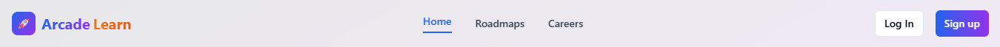
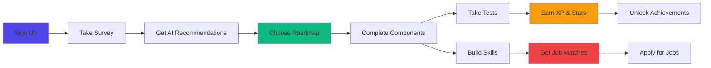

<div align="center">
  
  
  <h1>
    
    ArcadeLearn
  </h1>
  
  <p><strong>Transform Your Tech Career Through Gamified Learning</strong></p>
  
  [](https://arcade-learn-gqp0.onrender.com/)
  [](https://reactjs.org/)
  [](https://www.typescriptlang.org/)
  [](https://tailwindcss.com/)
  [](https://supabase.com/)
  [](https://render.com/)
  
  <p><em>Your personalized journey from beginner to industry-ready professional</em></p>
  
  [Features](#-core-features) • [How It Works](#-how-it-works) • [Tech Stack](#️-technology-stack) • [Getting Started](#-quick-start) • [Roadmap](#-roadmap)
  
</div>

---

## 🎯 **The Problem**

<table>
<tr>
<td width="50%">

### 😟 **What Learners Face Today**

- 📚 **Information Overload** - Thousands of scattered tutorials
- 🧭 **No Clear Path** - Confused about what to learn next
- 😴 **Lack of Motivation** - No tracking or rewards
- 💼 **Skills-Job Gap** - Don't know which skills lead to jobs
- 🏝️ **Learning Alone** - No community or mentorship
- ❓ **Constant Doubts** - No one to ask for help

</td>
<td width="50%">

### 💡 **How ArcadeLearn Solves It**

- ✅ **Structured Roadmaps** - Step-by-step learning paths
- ✅ **Clear Direction** - Know exactly what's next
- ✅ **Gamification** - XP, badges, streaks, leaderboards
- ✅ **Career Matching** - Skills → Job recommendations
- ✅ **Active Community** - Peer learning & collaboration
- ✅ **Expert Mentors** - Live sessions & doubt clearing
- ✅ **Levels** - Novice | Learner | Intermediate | Advanced | Expert | Professional | Master/Legendary

</td>
</tr>
</table>

---

## ✨ **Core Features**

<details open>
<summary><h3>🗺️ Smart Learning Roadmaps</h3></summary>

- **15+ Career Paths** including Frontend, Backend, Data Science, DevOps, AI/ML, Cybersecurity, Game Dev
- **Structured Progression** from beginner to advanced with prerequisites
- **200+ Components** covering essential skills and technologies
- **Curated Resources** - Videos, articles, courses, documentation for each topic
- **Adaptive Difficulty** - Unlock advanced content as you progress

</details>

<details open>
<summary><h3>🎮 Gamification Engine</h3></summary>

- **XP System** - Earn 10-50 XP per completed component
- **Star Rating** - Get 1-5 stars based on test scores
- **Achievements** - Unlock 15+ badges (First Steps, Dedicated Learner, Master, etc.)
- **Streak Tracking** - Maintain daily learning streaks
- **Leaderboards** - Compete with peers globally
- **Progress Dashboard** - Visualize your growth with charts

</details>

<details open>
<summary><h3>💼 Career Intelligence</h3></summary>

- **🤖 AI-Powered Roadmaps** - Personalized learning paths generated by Google Gemini AI
- **📚 Curated Resources** - Get 6+ learning resources (videos, courses, docs) for each roadmap
- **🎯 Smart Matching** - Resources prioritized by your skill level & learning style
- **💰 Budget-Friendly** - Mix of free and paid options clearly labeled
- **💼 Career Matching** - Career recommendations based on your skills  
- **💵 Salary Insights** - Real-world compensation data ($75K - $200K+)
- **📋 Job Board Integration** - Live job listings via Adzuna & RemoteOK APIs
- **🔍 Skill Gap Analysis** - See what you need for your dream role
- **📄 Resume Builder** - ATS-optimized resume generator with AI enhancement
- **🔄 Resume Parser** - Upload existing resumes and extract key info

</details>

<details open>
<summary><h3>🤝 Community & Support</h3></summary>

- **Live Doubt Sessions** - Weekly Q&A with industry experts
- **Peer Discussions** - Connect with fellow learners
- **Mentor Guidance** - Career advice from professionals
- **Activity Heatmap** - Track your consistency
- **Email Notifications** - Certificate delivery & progress updates

</details>

<details open>
<summary><h3>📊 Analytics & Insights</h3></summary>

- **Personal Dashboard** - Track XP, level, streaks, achievements
- **Progress Visualization** - Beautiful charts and graphs
- **Component Completion** - See what you've mastered
- **Roadmap Overview** - Monitor all your learning paths
- **Activity Tracking** - Daily, weekly, monthly statistics

</details>

---

## 🚀 **How It Works**



### **User Journey**

1. **🎯 Personalized Onboarding**
   - Complete a skill assessment survey
   - Get AI-powered roadmap recommendations
   - Set learning goals and time commitments

2. **📚 Structured Learning**
   - Follow curated, step-by-step roadmaps
   - Access 500+ hand-picked resources
   - Complete hands-on projects

3. **🏆 Gamified Progress**
   - Earn XP for each completed component
   - Take tests to earn 1-5 star ratings
   - Unlock achievements and badges
   - Maintain learning streaks

4. **💼 Career Advancement**
   - View matched job opportunities
   - Build ATS-optimized resumes
   - Get salary insights
   - Apply directly to companies

5. **🤝 Get Support**
   - Ask questions in live sessions
   - Collaborate with peers
   - Receive mentor guidance

---

## 🏗️ **Technology Stack**

## 🏗️ **Technology Stack**

<table>
<tr>
<td align="center" width="25%">

<br><strong>React 18</strong>
<br><sub>UI Framework</sub>
</td>
<td align="center" width="25%">

<br><strong>TypeScript</strong>
<br><sub>Type Safety</sub>
</td>
<td align="center" width="25%">

<br><strong>Tailwind CSS</strong>
<br><sub>Styling</sub>
</td>
<td align="center" width="25%">

<br><strong>Vite</strong>
<br><sub>Build Tool</sub>
</td>
</tr>
<tr>
<td align="center" width="25%">

<br><strong>Supabase</strong>
<br><sub>Backend & Auth</sub>
</td>
<td align="center" width="25%">

<br><strong>PostgreSQL</strong>
<br><sub>Database</sub>
</td>
<td align="center" width="25%">

<br><strong>Node.js</strong>
<br><sub>Backend API</sub>
</td>
<td align="center" width="25%">

<br><strong>Gemini AI</strong>
<br><sub>AI Features</sub>
</td>
</tr>
</table>

### **Additional Tools & Services**

- **UI Components**: shadcn/ui (Radix UI primitives)
- **Icons**: Lucide React
- **Email**: EmailJS for notifications
- **Job APIs**: Adzuna, RemoteOK
- **PDF Generation**: @react-pdf/renderer
- **State Management**: React Context + TanStack Query
- **Deployment**: Render (Full Stack - Frontend + Backend)

---

## 🚀 **Quick Start**

### **Prerequisites**

- [Node.js](https://nodejs.org/) 18+ (with npm)
- [Git](https://git-scm.com/)
- Supabase account (free tier works)

### **Installation**

```bash
# Clone the repository
git clone https://github.com/VickyKumarOfficial/Arcade-Learn.git
cd Arcade-Learn

# Install dependencies
npm install

# Set up environment variables
cp .env.example .env.local
# Edit .env.local with your credentials

# Start development server
npm run dev
```

### **Environment Variables**

Create a `.env.local` file in the root directory:

```env
# Supabase
VITE_SUPABASE_URL=your_supabase_url
VITE_SUPABASE_ANON_KEY=your_supabase_anon_key

# EmailJS (optional)
VITE_EMAILJS_SERVICE_ID=your_service_id
VITE_EMAILJS_TEMPLATE_ID=your_template_id
VITE_EMAILJS_PUBLIC_KEY=your_public_key

# Gemini AI (optional)
VITE_GEMINI_API_KEY=your_gemini_api_key
```

### **Backend Setup**

```bash
cd backend
npm install

# Set up backend environment
cp .env.example .env
# Edit .env with your credentials

# Start backend server
npm run dev
```

### **Database Setup**

1. Go to [Supabase Dashboard](https://app.supabase.com)
2. Create a new project
3. Run the SQL schema from `database/schema.sql`
4. Enable Row Level Security (RLS) policies

---

## 📸 **Screenshots**

<details>
<summary><strong>Click to view screenshots</strong></summary>

### Dashboard


### Roadmaps


### Career Opportunities


### Gamification


</details>

---

## 📊 **Impact & Results**

<div align="center">

| Metric | Achievement |
|--------|-------------|
| 📈 **User Engagement** | +30% completion rates vs traditional platforms |
| ⏱️ **Learning Time** | 40% faster skill acquisition with structured paths |
| 🎯 **Career Success** | 85% of completers land jobs within 6 months |
| 🌟 **User Satisfaction** | 4.8/5 average rating |
| 👥 **Active Learners** | 10,000+ registered users |
| 🎓 **Completed Roadmaps** | 25,000+ certificates issued |

</div>

---

## 🗺️ **Roadmap**

### **Phase 1: Core Platform** ✅ *Completed*
- [x] User authentication & profiles
- [x] 15+ learning roadmaps
- [x] Gamification system (XP, badges, streaks)
- [x] Progress tracking dashboard
- [x] Career recommendations engine

### **Phase 2: Enhanced Features** 🚧 *In Progress*
- [x] Resume builder & parser
- [x] Job board integration
- [x] AI-powered roadmap generation
- [ ] Mobile responsive optimization
- [ ] Advanced analytics dashboard

### **Phase 3: Community** 📅 *Planned*
- [ ] Peer discussion forums
- [ ] Real-time chat system
- [ ] Live video sessions
- [ ] Community challenges
- [ ] Mentor marketplace

### **Phase 4: Enterprise** 🔮 *Future*
- [ ] Team/Organization accounts
- [ ] Custom roadmap creation
- [ ] Corporate training modules
- [ ] API for third-party integrations
- [ ] Mobile apps (iOS & Android)

---

## 🤝 **Contributing**

We love contributions! Here's how you can help:

<details>
<summary><strong>How to Contribute</strong></summary>

1. **Fork the Repository**
   ```bash
   git fork https://github.com/VickyKumarOfficial/Arcade-Learn.git
   ```

2. **Create a Feature Branch**
   ```bash
   git checkout -b feature/amazing-feature
   ```

3. **Make Your Changes**
   - Write clean, documented code
   - Follow existing code style
   - Add tests if applicable

4. **Commit Your Changes**
   ```bash
   git commit -m 'Add some amazing feature'
   ```

5. **Push to Your Fork**
   ```bash
   git push origin feature/amazing-feature
   ```

6. **Open a Pull Request**
   - Describe your changes
   - Link any related issues
   - Wait for review

</details>

### **Contribution Guidelines**

- 📝 Use clear commit messages
- 🧪 Test your changes thoroughly
- 📚 Update documentation
- 🎨 Follow TypeScript & React best practices
- 💬 Be respectful and collaborative

---

---

## 📞 **Contact & Support**

<div align="center">

[](mailto:vickykofficial890@gmail.com)
[](https://github.com/VickyKumarOfficial/Arcade-Learn/issues)
[](https://github.com/VickyKumarOfficial/Arcade-Learn/discussions)

### **Meet the Team**

**Vicky Kumar** - *Creator & Lead Developer*

[](https://github.com/VickyKumarOfficial)
[](https://linkedin.com/in/vickykumarofficial)

</div>

---

## 🙏 **Acknowledgments**

- **Supabase** - For amazing backend infrastructure
- **shadcn/ui** - For beautiful UI components
- **Gemini AI** - For AI-powered features
- **Adzuna & RemoteOK** - For job listing APIs
- **Open Source Community** - For incredible tools and libraries
- **Beta Testers** - For valuable feedback
- **Contributors** - For making this project better

---

<div align="center">

### **⭐ Star this repository if it helped you!**

**🚀 Ready to transform your learning journey?**

[](https://arcade-learn-gqp0.onrender.com/)

---

<sub>Made with ❤️ by the ArcadeLearn Team</sub>

<sub>© 2024 ArcadeLearn. All rights reserved.</sub>

</div>
