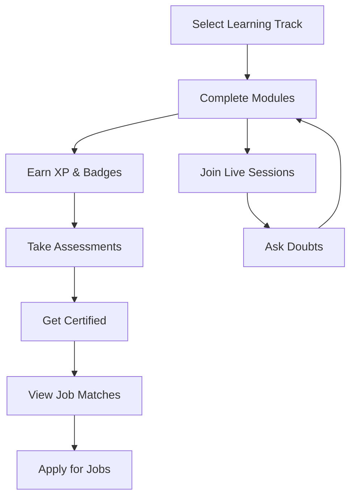

# 🎮 ArcadeLearn

<div align="center">


**Transforming tech education with structured roadmaps, gamification, and career-focused insights.**

[](https://lovable.dev/projects/9f593e79-c9cb-413b-8e21-03235e70fbdb)
[](LICENSE)
[](#team)

*An innovative platform designed to guide learners from foundational knowledge to career success through gamified learning experiences.*

</div>

---

## 🚀 **Overview**

ArcadeLearn is a revolutionary collaborative learning platform that transforms scattered tutorials and confusing educational paths into clear, engaging, and gamified learning journeys. We bridge the gap between learning and real-world career opportunities through structured roadmaps, certification tracking, and interactive mentorship.

### ✨ **What Makes Us Different**

- **🎯 Curated Learning Paths** - Step-by-step roadmaps for tech domains
- **🏆 Gamification System** - XP points, badges, streaks, and competitive elements
- **🎓 Certification Tracking** - Real certifications with industry recognition
- **💼 Job Integration** - Direct job recommendations based on completed courses
- **👩‍🏫 Live Mentorship** - Interactive doubt sessions and career guidance
- **📊 Progress Analytics** - Personalized dashboards with visual progress tracking

---

## 🎯 **Problem We Solve**

In today's fast-paced tech world, learners face several challenges:

| **Challenge** | **Our Solution** |
|---------------|------------------|
| **Fragmented Learning** | Structured, interconnected roadmaps |
| **Lack of Direction** | Clear "what to learn next" guidance |
| **Demotivation** | Gamified progress tracking with rewards |
| **Skills-Job Gap** | Direct job matching with completed skills |
| **Isolation** | Collaborative learning with peer interaction |
| **No Mentorship** | Live expert sessions and doubt clearing |

---

## 🌟 **Key Features**

### 📚 **Learning & Progress**
- **Curated Learning Tracks**: DSA, AI/ML, Data Science, Web Development, and more
- **Interactive Modules**: Hands-on projects and real-world challenges
- **Progress Visualization**: Track milestones with beautiful dashboards
- **Certification System**: Earn industry-recognized certifications

### 🎮 **Gamification Elements**
- **XP Points System**: Earn points for completed modules and achievements
- **Badge Collection**: Unlock special badges for milestones and challenges
- **Streak Rewards**: Maintain learning streaks for bonus points
- **Leaderboards**: Compete with peers in friendly competition
- **Achievement Unlocks**: Special rewards for consistent learners

### 💼 **Career Integration**
- **Job Recommendations**: Get job suggestions based on completed courses
- **Salary Insights**: Real-world salary data linked to learning paths
- **Skill Matching**: Match your acquired skills with job requirements
- **Career Roadmaps**: Clear paths from learning to employment

### 🗣️ **Interactive Support**
- **Live Doubt Sessions**: Weekly interactive expert sessions
- **Peer Collaboration**: Connect and learn with fellow students
- **Mentor Guidance**: Get career advice from industry professionals
- **Community Forums**: Discuss topics and share knowledge

---

## 🛠️ **Technology Stack**

| **Layer** | **Technology** |
|-----------|---------------|
| **Frontend** | React + Vite + TypeScript |
| **Styling** | Tailwind CSS + shadcn-ui |
| **Backend** | Firebase (Auth + Firestore) |
| **Development** | Node.js + npm |

---

## 🚀 **Getting Started**

### **Prerequisites**

Before you begin, ensure you have the following installed:
- [Node.js](https://nodejs.org/) (with npm)
- [Git](https://git-scm.com/)

**💡 Recommended**: Install Node.js using [nvm](https://github.com/nvm-sh/nvm#installing-and-updating) for better version management.

### **Installation & Setup**

#### **Method 1: Clone and Run Locally**

```bash
# Step 1: Clone the repository
git clone <YOUR_GIT_URL>

# Step 2: Navigate to project directory
cd <YOUR_PROJECT_NAME>

# Step 3: Install dependencies
npm i

# Step 4: Start development server
npm run dev
```

#### **Method 2: GitHub Codespaces**

1. Navigate to the repository's main page
2. Click the "Code" button (green button)
3. Select "Codespaces" tab
4. Click "New codespace"
5. Edit files directly and commit changes

#### **Method 3: Direct GitHub Editing**

1. Navigate to desired files in the repository
2. Click the "Edit" button (pencil icon)
3. Make changes and commit directly

---

## 📖 **How It Works**

### **User Journey**

1. **🎯 Choose Your Path** → Select a career-focused learning roadmap
2. **📚 Learn & Progress** → Complete modules, projects, and challenges
3. **🏆 Earn Rewards** → Gain XP points, badges, and streak bonuses
4. **📊 Track Progress** → Monitor goals in your personalized dashboard
5. **🗣️ Get Support** → Join live expert doubt-clearing sessions
6. **💼 Find Opportunities** → Explore job matches based on your skills
7. **💰 Visualize Career** → See salary ranges and career progression

### **Learning Process**



---

## 📊 **Impact & Results**

- **📈 +30% Completion Rates** through motivation-focused features
- **🎯 Higher Engagement** with gamification and competitive elements
- **🛤️ Clear Career Paths** linking learning to real opportunities
- **📚 Informed Decisions** connecting education to job prospects
- **🤝 Better Collaboration** through peer learning features

---

## 🔮 **Future Roadmap**

### **Phase 1: Core Enhancement**
- [ ] 📱 Mobile App for learning on-the-go
- [ ] 🎥 Video-based learning modules
- [ ] 📝 Advanced assessment system

### **Phase 2: Community Features**
- [ ] 👥 Peer Forums for collaboration & networking
- [ ] 💬 Real-time chat and discussion groups
- [ ] 🏆 Community challenges and hackathons

### **Phase 3: Advanced Integration**
- [ ] 🎓 Advanced Mentor Dashboards
- [ ] 💼 Direct Job Application Links
- [ ] 🤖 AI-powered learning recommendations
- [ ] 🏢 Corporate training modules

---

## 👥 **Team**

| **Roll No** | **Name** | **Role** |
|-------------|----------|----------|
| 2410030001 | Harshitha Reddy | Project Lead |
| 2410030021 | Dwarkesh | Backend Developer |
| 2410030023 | Bee Shiva | Frontend Developer |
| 2410030059 | Jahnavi | UI/UX Designer |
| 2410030110 | Smruti | Quality Assurance |
| 2410030111 | Nicky | DevOps Engineer |

---

## 📞 **Contact & Support**

- **📧 Email**: [team@arcadelearn.com](mailto:team@arcadelearn.com)
- **🐛 Issues**: [GitHub Issues](../../issues)
- **💬 Discussions**: [GitHub Discussions](../../discussions)
- **📚 Documentation**: [Wiki](../../wiki)

---

## 🙏 **Acknowledgments**

- Thanks to all contributors and beta testers
- Special thanks to our mentors and industry experts
- Firebase for backend infrastructure
- Open source community for amazing tools and libraries

---

<div align="center">

**⭐ Star this repository if you find it helpful!**

---

*Made with ❤️ by the ArcadeLearn Team*

</div>
