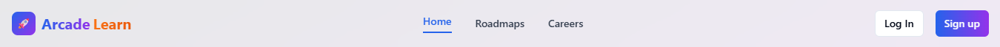

🎮 ArcadeLearn: Your Path to a Tech Career 🚀
Transforming tech education with structured roadmaps, gamification, and career-focused insights.

  

📖 Overview
ArcadeLearn is an innovative platform designed to guide learners from foundational knowledge to career success.
We turn scattered tutorials and confusing tools into clear, engaging, and gamified learning journeys.

👥 Team Members
Roll No.	Name
2410030001	Harshitha Reddy
2410030021	Dwarkesh
2410030023	Bee Shiva
2410030059	Jahnavi
2410030110	Smruti
2410030111	Nicky

❌ The Problem
In today’s fast-paced tech world, learners face:

Fragmented Learning → Disconnected tutorials and unlinked resources.

Lack of Direction → No guidance on “what to learn next.”

Demotivation → No clear progress tracking or tangible rewards.

💡 Our Solution
ArcadeLearn bridges the gap with:

🗺 Structured Roadmaps → Step-by-step guides for tech domains.

🏆 Gamification → XP points, badges, and streak rewards.

💼 Career Alignment → Salary insights for each learning path.

🎯 Expert Support → Weekly live mentor sessions.

✨ Key Features
Feature	Description
🗂 Curated Learning Paths	Tracks for DSA, AI/ML, Data Science, Web Development
🏅 Gamified Engagement	XP points, achievements, streak rewards
📊 Personalized Dashboard	Track milestones and progress visually
💬 Live Doubt Sessions	Weekly interactive expert sessions
💰 Salary Insights	Real-world salary data linked to paths

🛠 Tech Stack
Area	Technology
Frontend	React + Vite
Styling	Tailwind CSS
Backend	Firebase (Auth + Firestore)

🔍 How It Works
Choose Your Path → Select a career-focused roadmap.

Learn & Progress → Complete modules and challenges.

Earn Rewards → Gain XP, badges, and streak bonuses.

Track Progress → Monitor goals in your dashboard.

Get Support → Join live expert sessions.

Visualize Career → Explore salary ranges for your path.

📈 Expected Outcomes
📈 +30% Completion Rates through motivation-focused features.

🎯 Higher Engagement with gamification and rewards.

🛤 Clear Career Paths linked to real-world opportunities.

💡 Informed Decisions connecting learning to job prospects.

🚀 Future Plans
📱 Mobile App for learning on-the-go.

🧑‍🤝‍🧑 Peer Forums for collaboration & networking.

🧑‍🏫 Mentor Dashboards for better guidance.

💼 Direct Job Links for seamless employment transition.

⚙️ Project Setup
Follow these steps to run ArcadeLearn locally:

1️⃣ Clone the Repository
bash
Copy
Edit
git clone <YOUR_GIT_URL>
2️⃣ Navigate into the Project
bash
Copy
Edit
cd <YOUR_PROJECT_NAME>
3️⃣ Install Dependencies
bash
Copy
Edit
npm install
4️⃣ Start the Development Server
bash
Copy
Edit
npm run dev
Your app will now be running locally with hot reloading for instant updates.

🛠 Built With
⚡ Vite

📜 TypeScript

⚛ React

🎨 shadcn-ui

💠 Tailwind CSS

📢 ArcadeLearn is more than just learning — it’s your gamified path to success.
Level up your skills, track your journey, and land your dream job.

